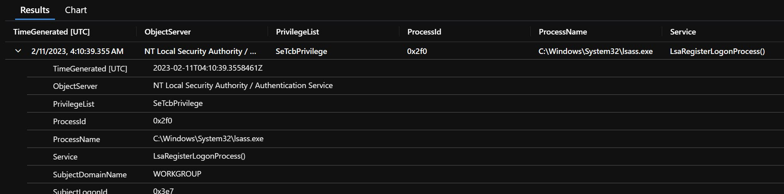

Below is an example of how to parse XML where each record has the same tag, but a different attribute value into individual columns in KQL. This is extremely helpful when manipulating Windows Event Data in an [Azure Log Analytics Workspace](https://learn.microsoft.com/en-us/azure/azure-monitor/logs/log-analytics-workspace-overview) where each XML tag in the event is named "data" and has its actual value identified in the attribute.

Below is an example of Windows Event data from the Log Analytics Workspace Event table.
```xml
<DataItem Type="System.XmlData" time="2023-02-11T04:10:40.3558461Z" sourceHealthServiceId="62e38380-b2ce-4fd8-a4c1-b1ba6a5382f2">
    <EventData xmlns="http://schemas.microsoft.com/win/2004/08/events/event">
        <Data Name="SubjectUserSid">S-1-5-18</Data>
        <Data Name="SubjectUserName">example-ea$</Data>
        <Data Name="SubjectDomainName">WORKGROUP</Data>
        <Data Name="SubjectLogonId">0x3e7</Data>
        <Data Name="ObjectServer">NT Local Security Authority / Authentication Service</Data>
        <Data Name="Service">LsaRegisterLogonProcess()</Data>
        <Data Name="PrivilegeList">SeTcbPrivilege</Data>
        <Data Name="ProcessId">0x2f0</Data>
        <Data Name="ProcessName">C:\Windows\System32\lsass.exe</Data>
    </EventData>
</DataItem>
```

Applying the KQL below will parse the XML event data, then call mv-apply to create the key/value pair based on the Data XML's attribute value and the text. The bag is then unpacked to create the columns.

_NOTE:_ The filter on TimeGenerated on line 3 and the projection of TimeGenerated on line 5 are there to obtain only one record back for this example.

```kusto
Event
| where TimeGenerated == todatetime('2023-02-11T04:10:39.3558461Z')
| extend d = parse_xml(EventData)
| project ed = d.DataItem.EventData.Data, TimeGenerated
| mv-apply ed on (
    extend key = tostring(ed["@Name"])
    | extend value = ed["#text"]
    | summarize b = make_bag(pack(key, value))
)
| evaluate bag_unpack(b)
```

The image below shows the XML Data rows from the Event data above transposed into individual columns based on the attribute name.

